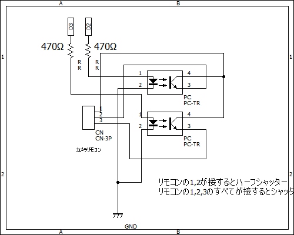

# SZ-14 Interval Timer Remote with Arduino

This project demonstrates how to build a simple Arduino-based remote shutter timer for Olympus SZ-14 digital camera. The remote simulates half-press and full-press signals every 5 minutes, using two optocouplers to trigger the shutter circuit.

## 📷 Purpose

SZ-14 automatically enters sleep mode after 3 minutes of inactivity. Since sleep cannot be canceled by shutter press, this device sends a dummy half-press every 2m30s and 4m59s to prevent the sleep mode. A full shutter press is sent at exactly 5-minute intervals.

## 🔧 Hardware

- Arduino (Uno / Nano / Freaduino)
- 2 × PC817 optocouplers
- 2 × resistors (300Ω ~ 1kΩ)
- Custom remote shutter cable (based on Olympus RM-UC1 clone)
- Power: 4x NiMH AA batteries (to avoid auto-off from mobile batteries)

## 🔌 Remote Contact Info

Inside the RM-UC1-style remote:

- 3 metal contacts:
  - Top center contact = Half-press
  - All contacts shorted = Full-press (shutter)

## 🔌 Arduino Pin Assignments

| Arduino Pin | Function       |
|-------------|----------------|
| D2          | Half-press     |
| D3          | Full-press     |

## 🖥️ Sketch Overview

The sketch sends:
- A 1-second half-press after 2 minutes 30 seconds
- Another half-press after 4 minutes 59 seconds
- A full-press at 5 minutes
Then repeats in an infinite loop.

## 🧠 Circuit Diagram

*(Include a PNG / JPG / Fritzing file if available. You can also describe it in text form here.)*

## 📜 License

This project is licensed under the MIT License.  
Feel free to modify and reuse it for your own interval photography setups.

## 🙋‍♂️ Author

YourName  
[GitHub Profile](https://github.com/tdey48)

